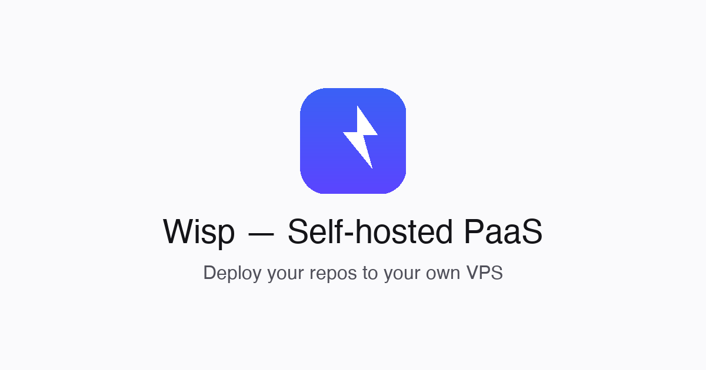

# Wisp

[](https://github.com/Andersseen/wisp/actions/workflows/ci.yml)
[](https://github.com/Andersseen/wisp/actions/workflows/release.yml)
[](./LICENSE)
[](https://bun.sh)
[](https://angular.dev)
[](https://www.docker.com)
[](https://github.com/Andersseen/wisp/commits/main)
[](https://github.com/Andersseen/wisp/labels/good%20first%20issue)

<p align="center">
  
</p>

> A lightweight, self-hosted PaaS for one VPS: auth, dashboard, jobs, Docker,
> SQLite, Valkey, and Caddy in one small Bun monorepo.

Wisp is an opinionated open-source platform-as-a-service toolkit for developers
who want Heroku-like deploys without running a heavy control plane. The goal is
simple: paste a git URL, build a Docker image, run it on your own VPS, and route
traffic through Caddy.

The project is pre-v1 and intentionally transparent about what is real today.
Auth sessions, the Angular dashboard, service ownership, DB schema, CI, and the
developer workflow are working. The build/run/routing pipeline is the next major
milestone, and contributors are very welcome there.

## Why Wisp

- **Single-server first** — built for one VPS, not a Kubernetes cluster.
- **Small operational surface** — Bun, SQLite, Valkey, Docker, and Caddy.
- **Honest roadmap** — specs and `docs/STATE.md` distinguish shipped code from
  stubs.
- **Contributor-friendly process** — typed errors, strict linting, focused
  specs, issue templates, CI gates, and a compact architecture.
- **Modern web stack** — Elysia API, Angular 21 zoneless dashboard, Drizzle ORM,
  BullMQ, and Tailwind CSS 4.

## Project Status

| Area | Status |
|---|---|
| Auth sessions | Working: `HttpOnly` cookies, `/auth/me`, logout, ownership checks |
| Dashboard shell | Working: login/register, service list/create, auth-aware layout |
| Database | Working: Drizzle/SQLite schema, migrations, seed user, FK cascades |
| CI/tooling | Working: lint, typecheck, tests, build, Docker image builds |
| Build pipeline | Next: git clone, Docker build, persisted job logs |
| Runtime routing | Planned: container lifecycle and Caddy admin API routing |
| Webhooks | Planned: signed GitHub push redeploys |

See [docs/STATE.md](./docs/STATE.md) for the exact current behavior and
[docs/PLAN.md](./docs/PLAN.md) for the v1 roadmap.

## 🏗 Architecture

```text
┌─────────────────┐      ┌──────────────────┐
│   Caddy :80/443 │──────▶  Angular dashboard │
│   (reverse proxy)│      │   apps/dashboard  │
└────────┬────────┘      └──────────────────┘
         │
         │ /api/*          ┌──────────────────┐
         └────────────────▶│   Elysia API     │
                           │   apps/core      │
                           └────────┬─────────┘
                                    │
            ┌───────────────┬───────┴───────┬───────────────┐
            ▼               ▼               ▼               ▼
      ┌──────────┐   ┌──────────┐   ┌──────────┐   ┌──────────┐
      │ SQLite   │   │ Valkey   │   │ Docker   │   │ Caddy    │
      │ Drizzle  │   │ BullMQ   │   │ Engine   │   │ Router   │
      └──────────┘   └──────────┘   └──────────┘   └──────────┘
```

## 🚀 Quick start

### Prerequisites

- [Bun](https://bun.sh) >= 1.0.0
- Docker + Docker Compose
- Node.js >= 20 (for Angular CLI)

### Install

```bash
git clone https://github.com/Andersseen/wisp.git
cd wisp
bun install
cp .env.example .env
# Generate SESSION_SECRET: openssl rand -hex 32
```

### Run locally

```bash
# Start Valkey, Caddy, and MinIO
docker compose -f infra/docker/dev.yml up -d

# Generate and apply the database schema
bun run db:generate
bun run db:migrate

# Optional: seed a demo user (demo@wisp.sh / demo1234)
bun run db:seed

# Start backend + frontend
bun run dev
```

The dashboard is available at `http://localhost` and the API at
`http://localhost/api/health`.

## Roadmap

Wisp is moving toward a focused v1:

1. Build pipeline: clone repos, run Docker builds, stream logs to jobs.
2. Runtime control: run/replace containers and manage Caddy routes.
3. Service detail: job history, logs, stop/start/rebuild/delete actions.
4. GitHub webhooks: signed push events that trigger redeploys.
5. Production hardening: install script, backups, docs, and VPS verification.

The detailed plan lives in [docs/PLAN.md](./docs/PLAN.md). Specs live in
[docs/specs/](./docs/specs/).

## 📦 Project structure

```text
wisp/
├── apps/
│   ├── core/              # Elysia API (Bun)
│   └── dashboard/         # Angular 21 SPA
├── packages/
│   ├── db/                # Drizzle schema + client
│   └── typescript-config/ # Shared tsconfigs
├── infra/
│   ├── docker/            # Compose files (dev/prod)
│   ├── caddy/             # Caddyfile configs
│   └── scripts/           # Install scripts
├── docs/                  # Architecture, conventions, specs
└── turbo.json             # Turborepo pipeline
```

## 🧪 Development commands

| Command | What it does |
|---|---|
| `bun run dev` | Backend (:3000) + frontend (:4200) in watch mode |
| `bun run lint` | Biome check across packages |
| `bun run check-types` | TypeScript `--noEmit` across packages |
| `bun run test` | Bun unit + integration tests |
| `bun run test:e2e` | Playwright dashboard tests |
| `bun run db:generate` | Generate Drizzle migrations |
| `bun run db:migrate` | Apply migrations |
| `bun run db:seed` | Seed dev data |
| `bun run build` | Build all packages |

## 🤝 Contributing

Contributions are welcome, especially if you enjoy infrastructure, developer
tools, Angular, Workers-style APIs, or making small systems feel polished.

Good places to start:

- Issues labeled
  [`good first issue`](https://github.com/Andersseen/wisp/labels/good%20first%20issue)
  or [`help wanted`](https://github.com/Andersseen/wisp/labels/help%20wanted).
- Docs improvements in `docs/`, especially where code and docs drift.
- Tests around auth, deploy routes, and future build pipeline behavior.
- Phase 3 work from the roadmap: Docker build jobs and persisted logs.

Please read [CONTRIBUTING.md](./CONTRIBUTING.md) for setup, commit conventions,
branch protection, and the pull request checklist.

All contributors are expected to follow our
[Code of Conduct](./CODE_OF_CONDUCT.md).

## Repository Topics

Suggested GitHub topics for discovery:

`paas`, `self-hosted`, `vps`, `docker`, `caddy`, `bun`, `elysia`, `angular`,
`sqlite`, `drizzle`, `bullmq`, `valkey`, `devops`, `platform-engineering`,
`developer-tools`

## 🔒 Security

Found a vulnerability? Please report it privately via
[GitHub Security Advisories](https://github.com/Andersseen/wisp/security/advisories/new)
or email <andriipap01@gmail.com>. See [SECURITY.md](./SECURITY.md) for our
responsible disclosure process.

## 📄 License

Wisp is released under the [MIT License](./LICENSE).

Copyright (c) 2026 [Andersseen](https://github.com/Andersseen).
